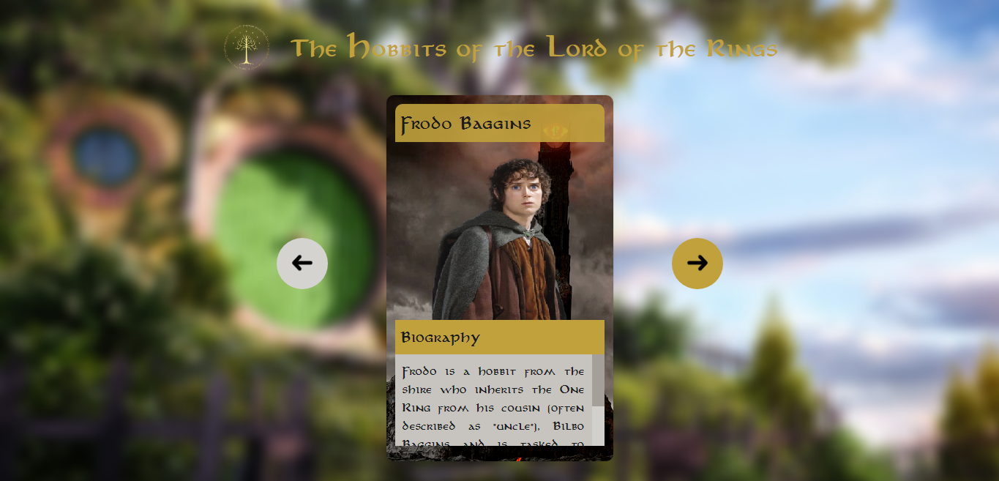

<h1 align="center"> Carrossel de Senhor dos Anéis </h1>

O Carrossel de Senhor dos Anéis foi um projeto desenvolvido durante a Dev Week, semana de imersão ministrada pelo  [Dev em Dobro](https://github.com/devemdobro). Esse projeto é a versão personalizada do projeto desenvolvidos pelas professores. 

  <a href="#-tecnologias">Tecnologias</a>&nbsp;&nbsp;&nbsp;|&nbsp;&nbsp;&nbsp;
  <a href="#-deploy">Deploy</a>&nbsp;&nbsp;&nbsp;|&nbsp;&nbsp;&nbsp;
  <a href="#-english">English Version</a>&nbsp;&nbsp;&nbsp;&nbsp;&nbsp;&nbsp;

  

## 🚀 Tecnologias
Esse projeto foi desenvolvido com as seguintes tecnologias:

- HTML
- CSS
- JavaScript
- Git
- Github

## 💻 Deploy
> [Clique aqui para navegar para o projeto!](https://ssschneider.github.io/lord-of-the-rings-slider/)

## 🌎 English Version

Lord of the Rings Slider is a project developed during the Dev Week, a coding imersion week taught by  [Dev em Dobro](https://github.com/devemdobro). This project is the personalized version of the original one, developed by the teachers. To do that, I've used:
- HTML, CSS, Javascript, Git and Github

You can check out the deploy by [clicking here](https://ssschneider.github.io/lord-of-the-rings-slider/)

---
### Desenvolvido por Sarah Schneider 🖖